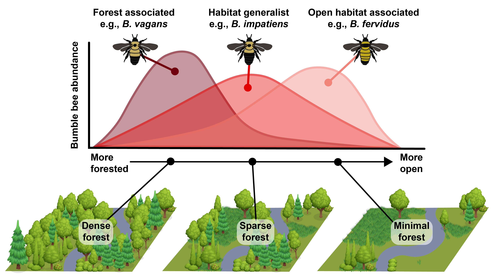

Approaching one decade of studying bumble bees, an emergent property became apparent to me in reading and keeping up with bumble bee ecology literature: forests often are an important part of the story, but they are rarely the _focus_ of the story. So, along with colleagues, we decided to review the literature and write a little review. Check it out!

**Paper Available Here:**

**J.M. Mola**, J. Hemberger, J. Kochanski, L. L. Richardson, and I. S. Pearse. 2021. Importance of forests in bumble bee biology and conservation. BioScience. [Link](https://doi.org/10.1093/biosci/biab121) 

*Figure 2 from the review illustrates how different bumble bee species may be associated with varied levels of forest cover in the landscape. The challenge for practicioners and bumble bee experts is making decisions about forest cover and quality in the landscape as they relate to bumble bee abundance and diversity*

<!--Maybe I want this to be more resource-limitation focused?-->

